# <div align="center">Universidad ORT Uruguay</div>

## <div align="center">Facultad de Ingeniería</div>

<div align="center">

### Documentación de obligatorio  

Certificado de DevOps  

Estudiantes grupo 10 :  

Diego Martinez (258343) – Andrihu Rabaquino (272028)

Tutor: Federico Barceló  
**2024**<div>


<div align='left'>

<br>
<br>


### Índice

* <a href="#caso-de-estudio">Caso de estudio</a>
* <a href="#planteamiento-para-la-resolución-del-problema">Planteamiento para la resolución del problema</a>
* <a href="#objetivos">Objetivos</a>
* <a href="#proyecto">Proyecto</a>
  - <a href="#herramientas-y-justificación-del-uso">Herramientas y justificación del uso</a>
  - <a href="#manejo-de-repositorios-y-estrategias-de-ramas">Manejo de repositorios y estrategias de ramas</a>
  - <a href="#seguimiento-del-proyecto-tablero-kanban">Seguimiento del proyecto, tablero Kanban</a>
  - <a href="#etapas-de-ci-cd">Etapas de CI/CD</a>
  - <a href="#deployments">Deployments</a>
  - <a href="#analisis-de-codigo-estatico-con-sonarcloud">Analisis de codigo estatico con SonarCloud</a>
  - <a href="#terraform-como-iac">Terraform como IaC</a>
  - <a href="#api-gateway-con-servicio-serverless">API Gateway con servicio Serverless</a>
  - <a href="#prueba-extra-endpoint">Prueba Extra EndPoint</a>


</div>

<br>
<br>

----

<br>

 ### Caso de Estudio 
<div align="left">
En el contexto de la transformación digital de una empresa líder en retail, se enfrenta a desafíos significativos relacionados con la integración y colaboración entre equipos de desarrollo y operaciones. La adopción rápida de metodologías ágiles y nuevas tecnologías reveló una brecha en la comunicación y entendimiento entre estos equipos durante el lanzamiento de una nueva aplicación, resultando en errores recurrentes y caídas del sistema.

Se busca mejorar la comunicación y colaboración, eliminar barreras en los flujos de trabajo, y establecer prácticas que promuevan una comprensión mutua de los desafíos y objetivos compartidos. Lo que no solo resolvera los problemas actuales, sino también establecera una base para la agilidad y resiliencia operativa a largo plazo, asegurando la posición competitiva de la empresa en el mercado.
</div>


---

### Planteamiento para la resolución del problema

<div align="left">
El planteamiento para la resolución del problema consiste en implementar un enfoque de DevOps que permita la integración y colaboración efectiva entre los equipos de desarrollo y operaciones. Esto implica la adopción de prácticas ágiles, automatización de procesos, implementación continua y monitoreo del sistema.

Para lograr esto, se propone establecer un pipeline de entrega continua que permita la implementación rápida y segura de nuevas funcionalidades. Además, se utilizarán herramientas de gestión de configuración y orquestación de contenedores para facilitar la escalabilidad y la gestión eficiente de la infraestructura.

El planteamiento para la resolución del problema se basa en la implementación de prácticas de DevOps que permitan mejorar la eficiencia en el desarrollo y operación de la aplicación, con el fin de garantizar la entrega de un producto de calidad y mantener la competitividad en el mercado.
</div>


***
### Objetivos

<div align="left">

1. **Planificación con Kanban:**
   - Usar un tablero Kanban para planificar y seguir tareas.

2. **Ciclos CI/CD:**
   - Desarrollar ciclos de CI/CD para Dev, Test y Prod con al menos tres etapas cada uno.

3. **Deployments:**
   - Empaquetar y desplegar 3 aplicaciones backend en AWS.
   - Desplegar 1 aplicación frontend en un S3 bucket de AWS.

4. **Pruebas:**
   - Realizar prueba extra y registrar resultados.

5. **Análisis de Código:**
   - Usar herramientas de análisis de código estático y documentar mejoras.

6. **Gestión de Repositorios Git:**
   - Almacenar el código en repositorios de Git con una estrategia de ramas adecuada y flujo de feature branch.

7. **Diagramas de Integración:**
   - Crear diagramas de flujos de integración para desarrollo y DevOps.

8. **Documentación:**
   - Documentar la implementación e información relevante en el repositorio de GitHub.

9. **Diagramas de CI/CD:**
   - Crear diagramas de procesos CI/CD.

10. **Infrastructure as Code:**
    - Manejar la infraestructura en la nube como Infrastructure as Code (IaC).

11. **Tareas Serverless:**
    - Implementar tareas con servicios serverless (AWS Lambda, API Gateway o CloudFront).

</div>

***


<h2 style="border: none;" id="proyecto">Proyecto</h2>


### Herramientas y justificación del uso.

<div align="left">
  
* **GitHub:**
  - Plataforma de alojamiento de código que facilita la colaboración y gestión de repositorios mediante control de versiones.

* **GitHub Actions:**
  - Herramienta de automatización de workflows que permite la implementación de CI/CD directamente en los repositorios de GitHub.

* **Docker:**
  - Permite crear, desplegar y ejecutar aplicaciones en contenedores, asegurando la consistencia y portabilidad del software.

* **Docker Hub:**
  - Registro de contenedores que facilita el almacenamiento, distribución y gestión de imágenes de Docker.

* **SonarCloud:**
  - Servicio de análisis de código que ayuda a identificar bugs, vulnerabilidades y problemas de calidad en el código fuente.

* **AWS:**
  - Proveedor de servicios en la nube que ofrece una amplia gama de servicios para desplegar y gestionar aplicaciones de manera escalable y segura.

* **Kubernetes:**
  - Orquestador de contenedores que automatiza la implementación, escalado y gestión de aplicaciones en contenedores.

* **Terraform:**
  - Herramienta de Infrastructure as Code (IaC) que permite definir y provisionar infraestructura en la nube de manera declarativa.

* **Postman:**
  - Plataforma de desarrollo de API que facilita la creación, prueba y documentación de APIs.

* **Newman:**
  - CLI para ejecutar colecciones de Postman, permitiendo la integración de pruebas automatizadas en los pipelines de CI/CD.

* **Visual Studio Code:**
  - Editor de código fuente altamente configurable y extensible.

  
</div>

*** 

### Manejo de repositorios y estrategias de ramas

<div align="left">

**GitFlow - Desarrollo**


1. Ramas principales:
   - master: Contiene el código en producción.
   - release: Para preparar nuevas versiones.
   - develop: Contiene la última versión en desarrollo.

2. Ramas auxiliares:
   - feature: Para nuevas funcionalidades.
   - hotfix: Para correcciones urgentes en producción.
   - bugfix: Para correcciones en la etapa de prueba antes del lanzamiento.
  
¿Por qué GitFlow? 

- Facilita el manejo de múltiples versiones simultáneamente.
- Permite desarrollar nuevas funcionalidades de manera aislada.
- Gestión eficiente de errores críticos y bugs.
- Mantiene una historia de commits clara y organizada.
- Proporciona una rama dedicada para la preparación y estabilización de lanzamientos.

<br>


**Diagrama** 

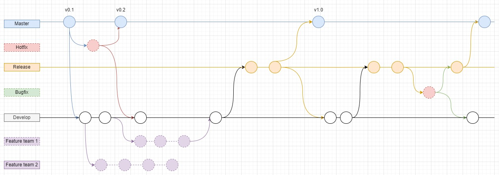


***


**Trunk-Based DevOps**

1. Ramas estables:
   - master: Contiene el código listo para producción.
   - release: Para lanzar versiones estables del software.

Trunk-Based promueve la integración continua y el despliegue continuo, facilitando una entrega rápida y eficiente del software.


**Diagrama** 

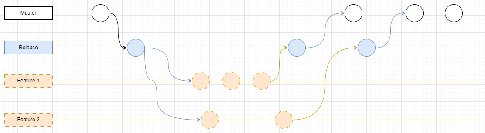


</div>

*** 

### Seguimiento del proyecto, tablero Kanban.

<div align="left">

**Semana 1**


**Semana 2**


**Semana 3**


</div>


### Etapas de CI CD

<div align="left">

> **FrontEnd**

El flujo de trabajo CI/CD se activa automáticamente cuando se hace un commit en las ramas `develop`, `release` o `main`. Consta de tres instancias principales: `build`, `sonarcloud` y `deploy`.


### 1. Instancia de Build

**Descripción:**
- **Objetivo:** Construir el proyecto Angular.
- **Pasos:** 
  - Se realiza el checkout del código fuente.
  - Se configura Node.js y se instalan las dependencias necesarias.
  - Se instala Angular CLI y se construye el proyecto.
  - Los artefactos de construcción se suben para ser utilizados en las siguientes instancias.

### 2. Instancia de SonarCloud

**Descripción:**
- **Objetivo:** Realizar el análisis de código estático utilizando SonarCloud.
- **Pasos:** 
  - Se realiza el checkout del código fuente.
  - Se configura Node.js y Java.
  - Se instala SonarScanner y se ejecuta el análisis de SonarCloud utilizando las credenciales configuradas.
- **Dependencia:** Este job se ejecuta después de que la instancia de build haya finalizado correctamente.

### 3. Instancia de Deploy
**Descripción:**
- **Objetivo:** Desplegar los artefactos construidos en un bucket S3.
- **Pasos:** 
  - Se realiza el checkout del código fuente.
  - Se configuran las credenciales de AWS.
  - Se descargan los artefactos construidos y se despliegan en el bucket S3 correspondiente según la rama (`develop`, `release` o `main`).
- **Dependencia:** Este job se ejecuta después de que las instancias de build y sonarcloud hayan finalizado correctamente.

<br>

> **BackEnd**

El flujo de trabajo CI/CD para el backend se activa automáticamente cuando se hace un commit en las ramas `develop`, `release` o `main`. El trabajo de todas las ramas se ejecutas desde un mismo archivo de trabajo. El flujo de trabajo consta de cuatro instancias principales: `build`, `sonarcloud`, `build_and_deploy_dockerhub` y `deploy and test endpoint`.

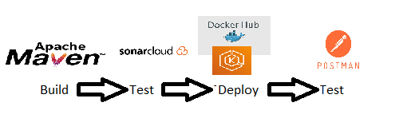


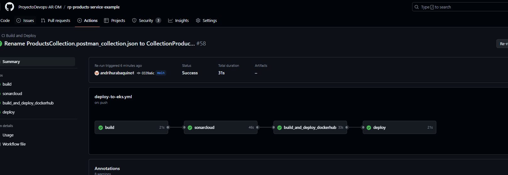

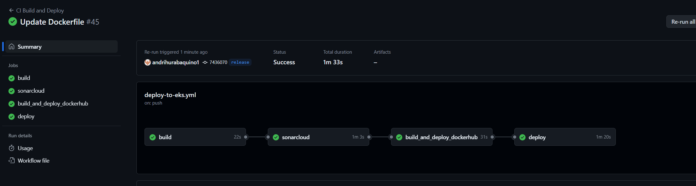

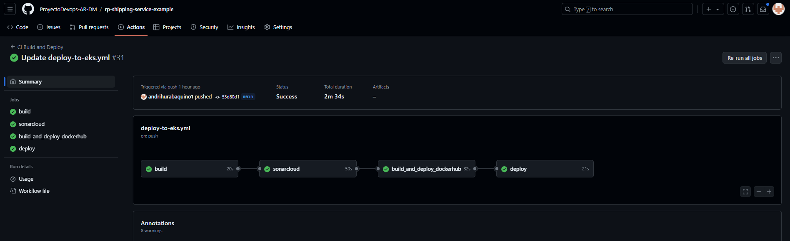

**Descripción:**
- **Objetivo:** Construir el proyecto utilizando Maven.
- **Pasos:** 
  - Se realiza el checkout del código fuente.
  - Se configura el JDK 11.
  - Se construye el proyecto con Maven.
- **Rama:** Esta instancia se ejecuta en la rama correspondiente (`develop`, `release` o `main`).

### 2. Instancia de SonarCloud

**Descripción:**
- **Objetivo:** Realizar el análisis de código estático utilizando SonarCloud.
- **Pasos:** 
  - Se realiza el checkout del código fuente.
  - Se configura Java 17.
  - Se construye el proyecto con Maven.
  - Se instala SonarScanner y se ejecuta el análisis de SonarCloud utilizando las credenciales configuradas.
- **Dependencia:** Este job se ejecuta después de que la instancia de build haya finalizado correctamente.
- **Rama:** Esta instancia se ejecuta en la rama correspondiente (`develop`, `release` o `main`).

### 3. Instancia de Build and Deploy DockerHub

**Descripción:**
- **Objetivo:** Construir y desplegar la imagen Docker en Docker Hub.
- **Pasos:** 
  - Se realiza el checkout del código fuente.
  - Se configura Java 17.
  - Se construye el proyecto con Maven.
  - Se inicia sesión en Docker Hub.
  - Se construye la imagen Docker y se despliega en Docker Hub.
- **Dependencia:** Este job se ejecuta después de que las instancias de build y sonarcloud hayan finalizado correctamente.
- **Rama:** Esta instancia se ejecuta en la rama correspondiente (`develop`, `release` o `main`).

### 4. Instancia de Deploy

**Descripción:**
- **Objetivo:** Desplegar la imagen Docker en Kubernetes utilizando AWS EKS y realizar el Test de endpoint.
- **Pasos:** 
  - Se realiza el checkout del código fuente.
  - Se configura AWS CLI y kubectl.
  - Se actualiza el archivo kubeconfig con la configuración del cluster EKS.
  - Se valida el archivo de despliegue YAML y se aplica en Kubernetes.
  - Se despliega el balanceador del servicio. 
  - Se obtiene la url brindad por el balanceador 
  - Se realiza la prueba de endpoint utlizando postman y newman. 
- **Dependencia:** Este job se ejecuta después de que la instancia de build_and_deploy_dockerhub haya finalizado correctamente.
- **Rama:** Esta instancia se ejecuta en la rama correspondiente (`develop`, `release` o `main`).

---
</div>

### Deployments 

<div align="left">

El despliegue de la aplicación, tanto para el frontend como para el backend, se realiza automáticamente a través de GitHub Actions. Dependiendo de la rama (`develop`, `release`, `main`), los artefactos de construcción se despliegan en los entornos configurados utilizando AWS S3, Docker Hub y AWS EKS. Este proceso asegura una entrega continua y eficiente de las nuevas versiones de la aplicación, manteniendo la consistencia y disponibilidad en los entornos de desarrollo, prueba y producción.

---
</div>


### Analisis de codigo estatico con SonarCloud


<div align="left">

SonarCloud se utiliza como una herramienta de análisis de código estático para garantizar la calidad del código en los proyectos frontend y backend. El análisis se realiza automáticamente en cada commit hecho en las ramas `develop`, `release` y `main`.


**Proceso de Análisis:**

1. **Integración en GitHub Actions:** El workflow de GitHub Actions incluye un job dedicado a ejecutar el análisis de SonarCloud después de la construcción del proyecto.
2. **Configuración del Entorno:** Se configura SonarScanner en el entorno de CI/CD, utilizando las credenciales y el token de SonarCloud.
3. **Ejecución del Análisis:** SonarScanner analiza el código fuente y envía los resultados a SonarCloud.
4. **Generación de Reportes:** SonarCloud proporciona reportes detallados sobre la calidad del código, incluyendo métricas como cobertura de pruebas, duplicación de código, y posibles vulnerabilidades.

<br>

**Evidencias FrontEnd**


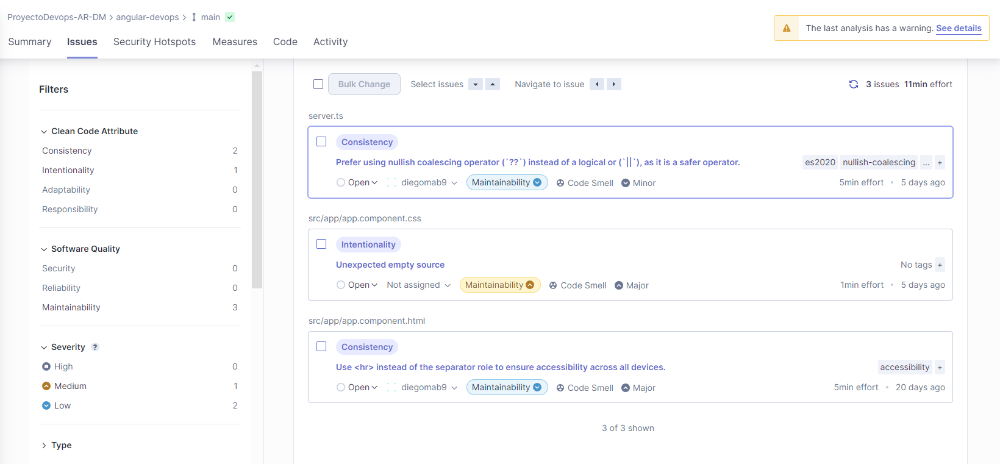

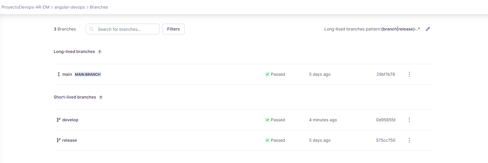

<br>

**BackEnd**


**products-service**

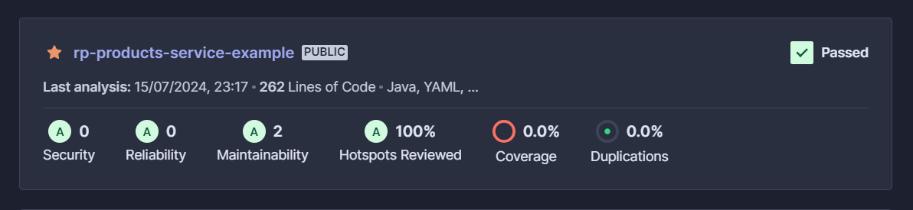

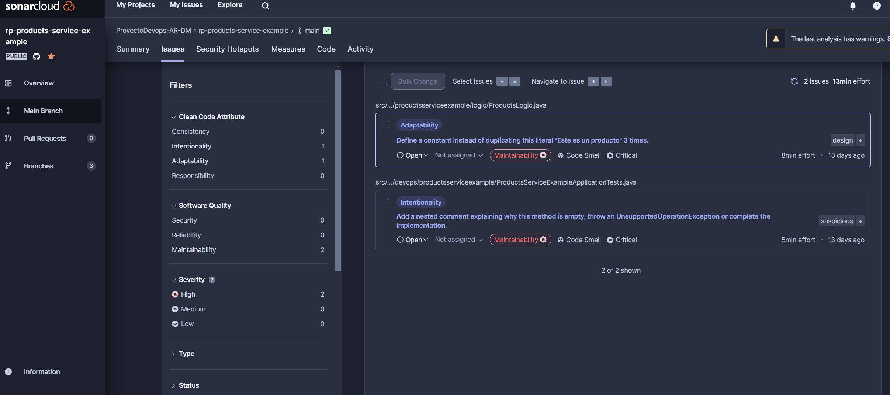

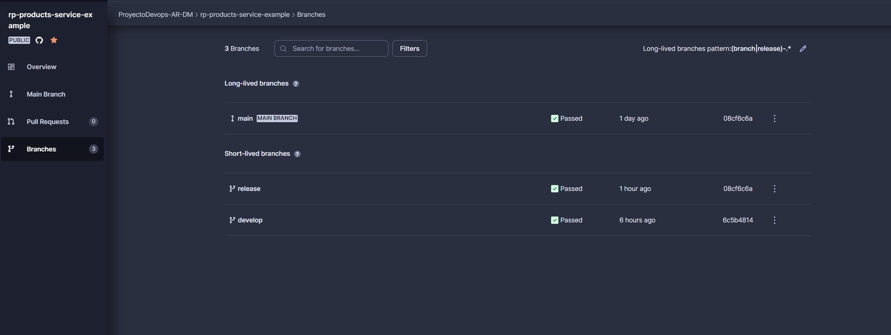


**orders-service**

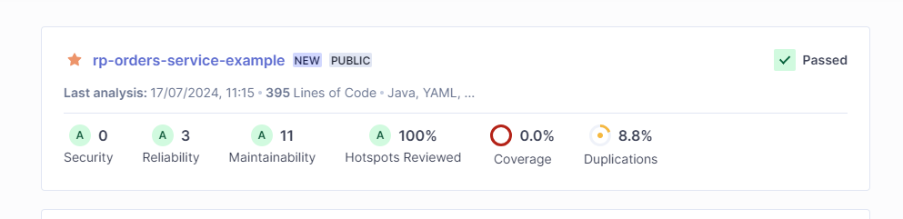


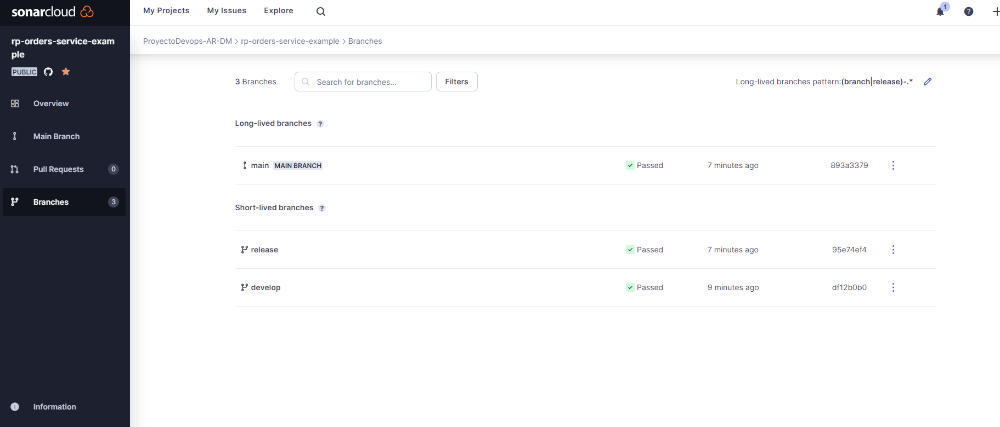


**shipping-service**

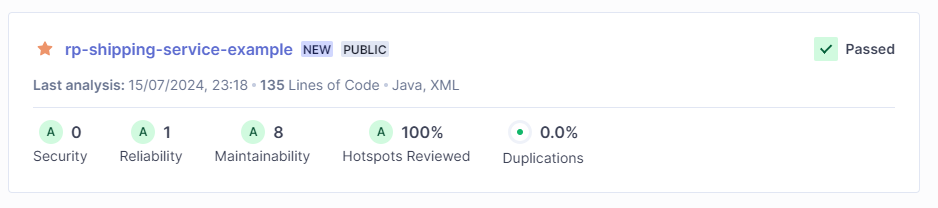

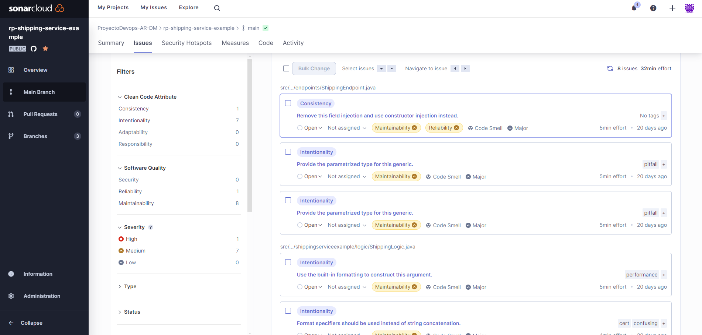

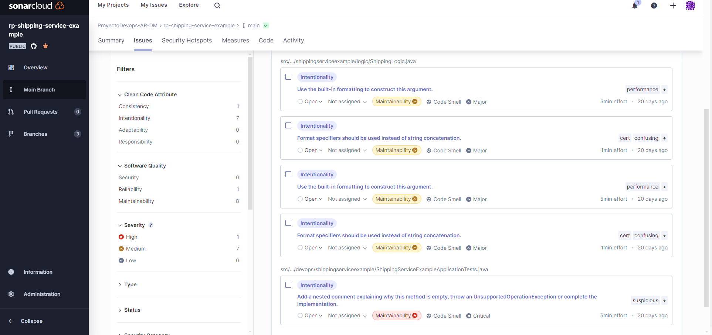

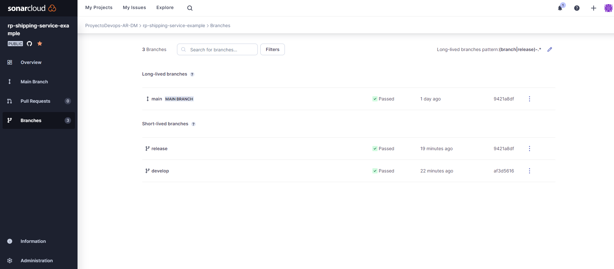


</div>


### Terraform como IaC


<div align="left">
En el proyecto, utilizamos Terraform para gestionar la infraestructura en la nube de forma automatizada y controlada.

<br>

**FrontEnd**

En este caso, usamos Terraform para crear y configurar instancias de almacenamiento en AWS S3.

Se define tres archivos,  `main.tf`, `variables.tf` y `terraform.tf`

- main.tf: Define los recursos específicos del bucket S3, como el nombre, configuraciones de hosting estático, versionado de objetos, y políticas de acceso.

- variables.tf: Declara variables utilizadas en main.tf, como claves de acceso de AWS, región, y nombre del bucket, permitiendo parametrizar y reutilizar la configuración.

- terraform.tf: Configura opciones globales de Terraform como la versión a utilizar, proveedores adicionales, y configuraciones de backend para el almacenamiento del estado.

<br>

**BackEnd**

En el caso del back tambien utilizamos terraform para crear los servicios que crean los ambientes para el correcto funcionamiento del sistema. 
Definimos 5 archivos, `main.tf`, `variables.tf`, `develop.tfvars`, `release.tfvars` y `prod.tfvars`

- main.tf: Define los servicios que se crearan en aws con sus respectivas caracteristicas (Nombre, zona de disponibilidad, tipo de instancia, etc). Los servicios que creara son los siguiente: 
            - Se creara una VPC, con 2 subredes (La subredes estaran en distintos puntos de disponibilidad), una tabla de enrutamiento, una internet gateway.
            - Se creara un EKS con asociada a la VPC y su grupo de nodos. 
- variables.tf: Define variable que corresponden a las caracteristicas de los componentes a crear como por ejemplo: Nombre del componente, rango de la sub red, version del eks etc. 
- develop.tfvars: Asocia los valores a las variables para desplegar el ambiente de Develop
- release.tfvars: Asocia los valores a las variables para desplegar el ambiente de release
- prod.tfvars: Asocia los valores para desplegar el ambiente de produccion. 

- *Aclaracion* es importante que a la hora de ejecutar terraform se especifique el archivo de variable de la siguiente forma: terraform apply -var-file="release.tfvars"

- Decidimos utilizar esta estructura de terraform ya que les permitira desplegar ambiente deseados de manera muy sencilla y agil. 

**Diagrama**
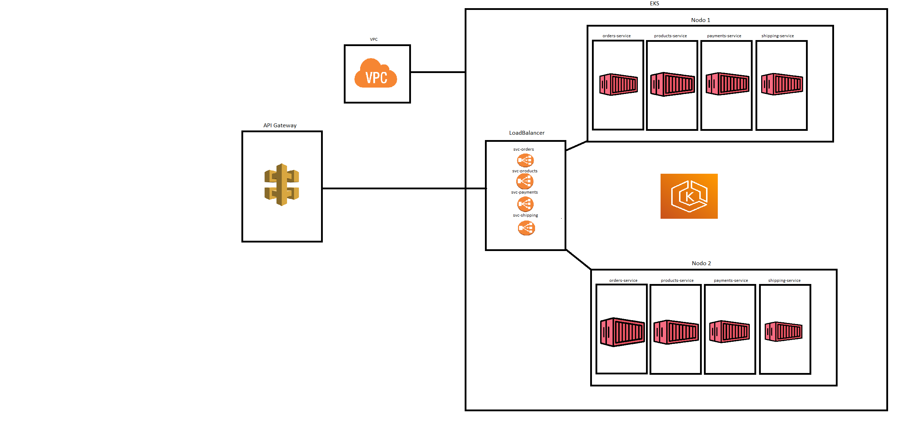


---
</div>


### API Gateway con servicio Serverless

<div align="left">

Como servicio Serverless el proyecto utilizo API Gateway de AWS para gestionar las solicitudes HTTP hacia nuestros servicios backend.

La configuración de Amazon API Gateway como un HTTP API proporciona una capa de seguridad adicional y una gestión centralizada de las rutas HTTP para nuestros servicios backend. Esto permite una mejor escalabilidad y mantenimiento de nuestros endpoints.

A continuación, se detallan las rutas configuradas:

### Integraciones

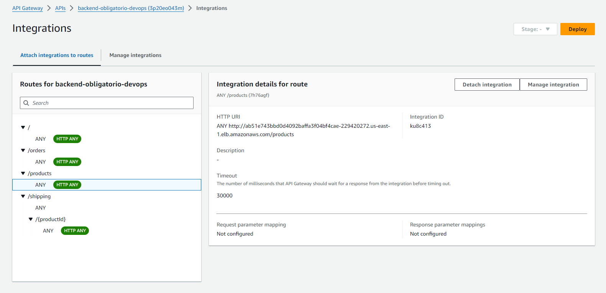


### Rutas Configuradas

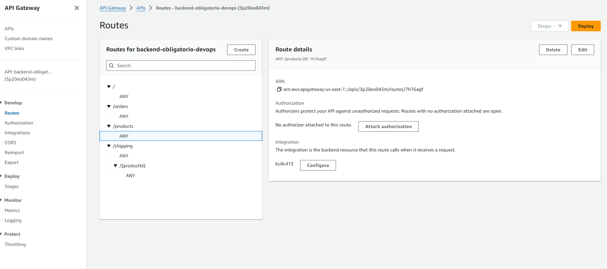


### POST /orders

- **Descripción**: Esta ruta permite la creación de nuevas órdenes.
- **Método**: POST
- **Endpoint**: `https://3p20eo043m.execute-api.us-east-1.amazonaws.com/orders`
- **Parámetros**: Se debe enviar una lista de IDs en el cuerpo de la solicitud (body) en formato raw JSON. Ejemplo:
  ```json
  {
    [ "321", "111" , "123" ]
  }
- **Evidencia** : 
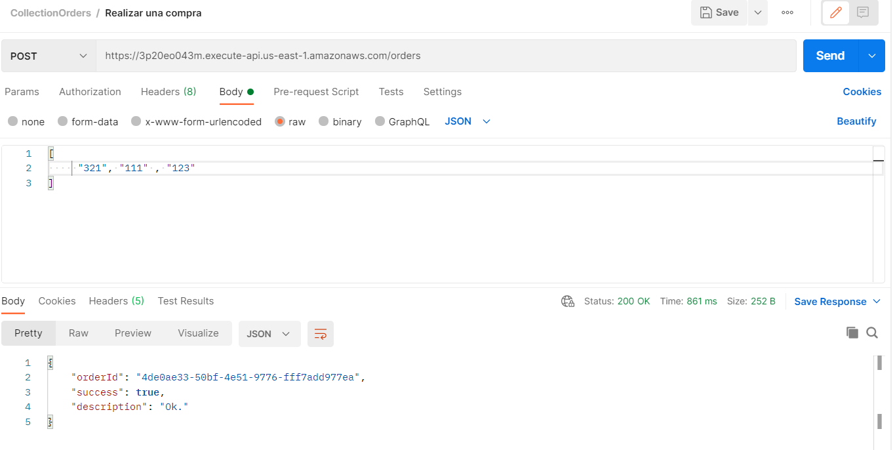


### GET /shipping/{shippingId}

- **Descripción**: Esta ruta permite obtener información de un envío específico utilizando el ID del envío.
- **Método**: GET
- **Endpoint del backend**: `https://3p20eo043m.execute-api.us-east-1.amazonaws.com/shipping/{shippingId}`
- **Evidencia** : 
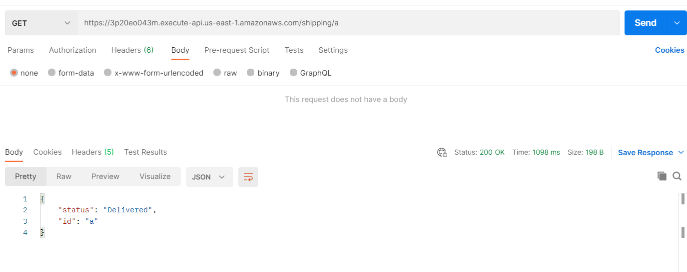

### GET /products

- **Descripción**: Esta ruta permite listar todos los productos disponibles.
- **Método**: GET
- **Endpoint del backend**: `https://3p20eo043m.execute-api.us-east-1.amazonaws.com/products`
- **Evidencia** : 
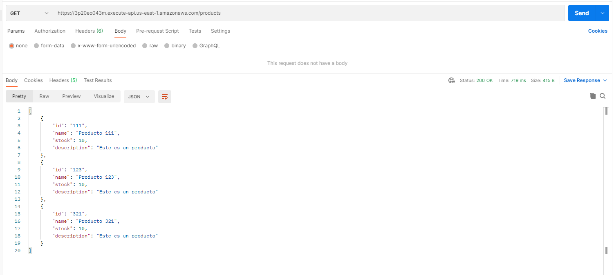

> [!WARNING]
> Antes del uso asegúrarse de que los servicios backend están correctamente desplegados en sus ambientes
> Si se hace alguna modificacion en el load balancer y se despliega desde 0 se debera cambiar la url de refernecia en la configuracion del API Gatway 


</div>


<hr>

### Prueba Extra EndPoint

<div align="left">
Como prueba extra, decidimos realizar una prueba de endpoint a traves de postaman y newman, la misma se ejecuta luego de que se realiza el deploy en AWS para corroborar el correcto funcionamiento del servicio deployado. 


</div>

### Containers

<div align="left">
En esta seccion hablaremos del armado de los contenedores donde se despliegaran los servicio backend.
- Se crearan 3 contenedores por medio de dockerfiles ubicados uno en cada repositorio de los servicios
- En cada contenedor se creara un usuario con los permisos restringidos para evitar vulnerabilidades de seguridad en el container
- Se exponen el puerto por el cual sera consumido ese servicio


**Dockerfile products-service**

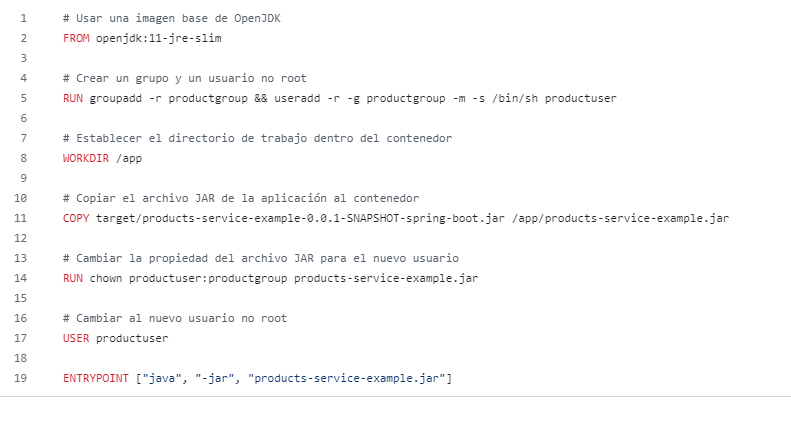

**Dockerfile orders-service** 

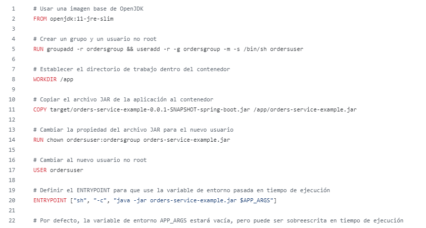

**Dockerfile shipping-service**

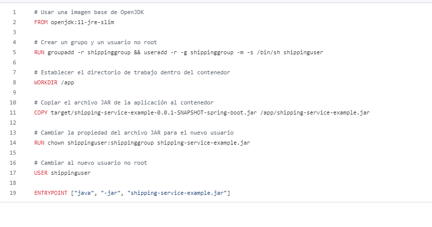

Estas imagenes se crearan desde el trabajo definido en el workflow de cada repositorio llamada buil_and_deploy_in_dockerhub y en el mismo trabajo se pushean al repositorio correspondiente en Docker Hub. 
Esta forma previa de realizar el deploy les dara la oportunidad al equipo de develop a poder ejecutar los servicios de manera local para realizar algunas pruebas, sin la necesidad de tenes que despliegar un nuevo ambiente en AWS.
De esta forma se podran evitar gastos inecesarios por pago de cloud.  


</div>